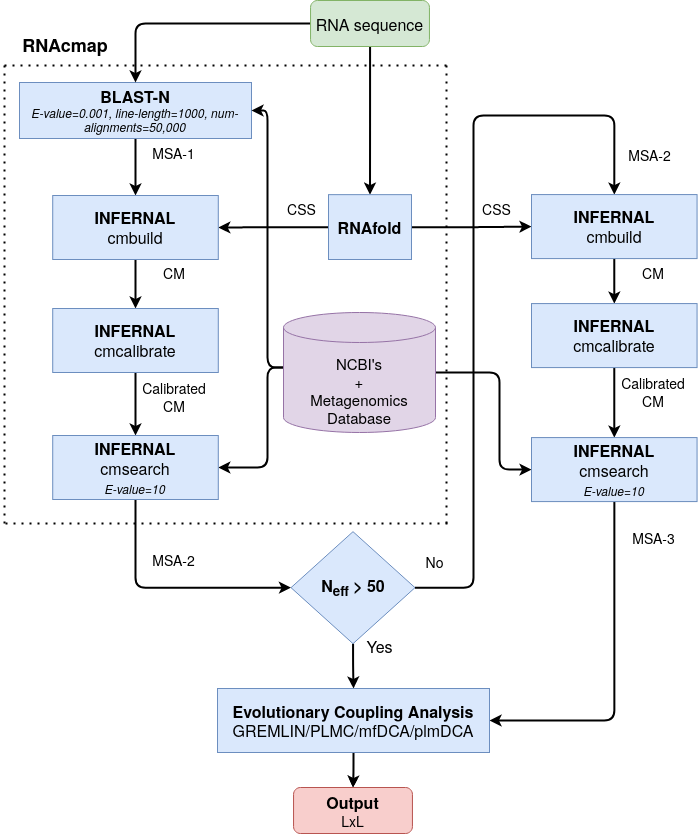
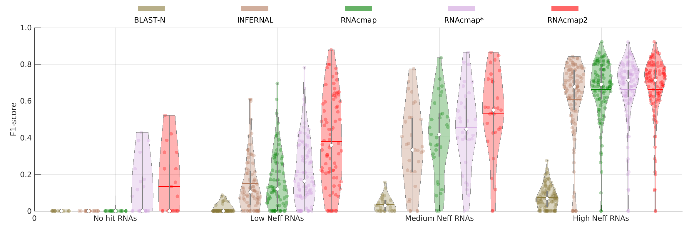
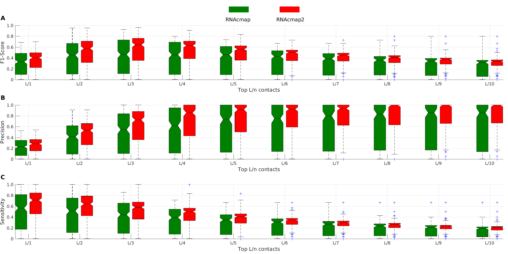

# RNAcmap2
An improved fully automatic pipeline for predicting contact maps of RNAs by evolutionary coupling analysis


|
|----|
| <p align="center"> <b>Figure 1:</b> The architecture of the RNAcmap2 pipeline. CSS: Consensus Secondary Structure. CM: Covariance Model. L: Length of the input RNA sequence.|

Activate the conda virtual environment

1. `conda activate venv_rnacmap2`


To obtain results in Table-2:

2. `./run.py --neff all --dca_method gremlin`

```
 	 	 	 	 	 No-hit RNAs

		       F1	Precision	Sensitivity	No. of RNAs	Median Neff
blastn              0.000 	 0.000 		 0.000		    21		  0.0    
direct_infernal     0.000 	 0.000 		 0.000		    21		  0.0    
RNAcmap             0.000 	 0.000 		 0.000		    21		  0.0    
RNAcmap_meta        0.115 	 0.121 		 0.118		    21		  1.0    
RNAcmap2_meta       0.133 	 0.145 		 0.137		    21		  1.4    


 	 	 	 	 	 Low Neff RNAs

		       F1	Precision	Sensitivity	No. of RNAs	Median Neff
blastn              0.006 	 0.007 		 0.007		    83		  0.0    
direct_infernal     0.150 	 0.163 		 0.141		    83		  2.0    
RNAcmap             0.165 	 0.180 		 0.156		    83		  2.3    
RNAcmap_meta        0.213 	 0.231 		 0.204		    83		  4.1    
RNAcmap2_meta       0.380 	 0.418 		 0.357		    83		  13.0    


 	 	 	 	 	 Medium Neff RNAs

		       F1	Precision	Sensitivity	No. of RNAs	Median Neff
blastn              0.035 	 0.040 		 0.032		    31		  1.0    
direct_infernal     0.343 	 0.395 		 0.307		    31		  17.0    
RNAcmap             0.404 	 0.460 		 0.368		    31		  26.5    
RNAcmap_meta        0.457 	 0.518 		 0.426		    31		  31.6    
RNAcmap2_meta       0.531 	 0.598 		 0.487		    31		  123.2    


 	 	 	 	 	 High Neff RNAs

		       F1	Precision	Sensitivity	No. of RNAs	Median Neff
blastn              0.074 	 0.087 		 0.066		    110		  2.1    
direct_infernal     0.607 	 0.698 		 0.540		    110		  335.1    
RNAcmap             0.663 	 0.760 		 0.591		    110		  636.5    
RNAcmap_meta        0.663 	 0.761 		 0.591		    110		  605.1    
RNAcmap2_meta       0.663 	 0.761 		 0.591		    110		  605.1
```


To obtain Figure-2 in the paper:

3. `./run.py --neff all --dca_method gremlin --figure 2`

Above command save performance metrics (in csv) for different MSA pipelines in `figure\_2\_data` folder. Following MATLAB script can be used to plot Figure-2:

4. `cat figure_2.m | path\_to\_matlab\_bin\_directory/matlab -nodesktop -nosplash`

Above command generate figure as shown below:

|
|----|
| <p align="center"> <b>Figure 2:</b> Violin plot of F1-score of predicted top L/3 contacts by GREMLIN DCA predictor using BLAST-N, INFERNAL, RNAcmap, RNAcmap*, and RNAcmap2 supplied aligned homologous sequences for No-hit RNAs (21 RNAs), Low Neff RNAs (83 RNAs), Medium Neff RNAs (31 RNAs) and high Neff RNAs (110 RNAs).|


To obtain Figure-3 results:

5. `./figure_3.py --neff all --dca_method mfdca`

Above progrmas save `csv` files for top L/n contacts in `figure\_3\_data` folder. Next, run the following matlab program to obtain Figure-3 plot:

6. `cat figure_3.m | path\_to\_matlab\_bin\_directory/matlab -nodesktop -nosplash`


Above command generate figure as shown below:

|
|----|
| <p align="center"> <b>Figure 3:</b> Boxplot of F1-score (A), Precision (B), and Sensitivity (C) as a function of predicted top L/n base pairs by mfDCA from RNAcmap (in green) and RNAcmap2 (in red) supplied alignment for 245 PDB RNAs. The distribution is shown in terms of median, 25th and 75th percentile with outlier shown by dots.|


To obtain Table-3 results, the followning commands can be used:

7. `./run.py --neff all_combined --dca_method gremlin`

```
 	 	 	 	 	 All Neff RNAs

		       F1	Precision	Sensitivity	No. of RNAs	Median Neff
blastn              0.040 	 0.046 		 0.036		    245		  1.0    
direct_infernal     0.367 	 0.419 		 0.329		    245		  14.0    
RNAcmap             0.404 	 0.460 		 0.365		    245		  27.1    
RNAcmap_meta        0.437 	 0.495 		 0.399		    245		  31.9    
RNAcmap2_meta       0.505 	 0.571 		 0.460		    245		  96.1
```

8. `./run.py --neff all_combined --dca_method plmc`

```
 	 	 	 	 	 All Neff RNAs

		       F1	Precision	Sensitivity	No. of RNAs	Median Neff
blastn              0.010 	 0.011 		 0.009		    245		  1.0    
direct_infernal     0.382 	 0.434 		 0.344		    245		  14.0    
RNAcmap             0.417 	 0.474 		 0.378		    245		  27.1    
RNAcmap_meta        0.455 	 0.516 		 0.416		    245		  31.9    
RNAcmap2_meta       0.531 	 0.598 		 0.487		    245		  96.1
```

9. `./run.py --neff all_combined --dca_method mfdca`

```
 	 	 	 	 	 All Neff RNAs

		       F1	Precision	Sensitivity	No. of RNAs	Median Neff
blastn              0.053 	 0.061 		 0.048		    245		  1.0    
direct_infernal     0.397 	 0.453 		 0.359		    245		  14.0    
RNAcmap             0.436 	 0.494 		 0.397		    245		  27.1    
RNAcmap_meta        0.474 	 0.536 		 0.434		    245		  31.9    
RNAcmap2_meta       0.549 	 0.618 		 0.505		    245		  96.1
```

10. `./run.py --neff all_combined --dca_method plmdca`

```
 	 	 	 	 	 All Neff RNAs

		       F1	Precision	Sensitivity	No. of RNAs	Median Neff
blastn              0.027 	 0.030 		 0.024		    245		  1.0    
direct_infernal     0.386 	 0.443 		 0.347		    245		  14.0    
RNAcmap             0.425 	 0.482 		 0.387		    245		  27.1    
RNAcmap_meta        0.464 	 0.526 		 0.425		    245		  31.9    
RNAcmap2_meta       0.542 	 0.610 		 0.497		    245		  96.1
```

